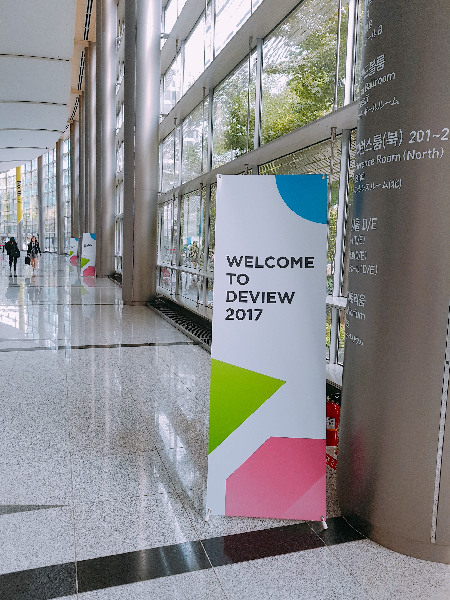
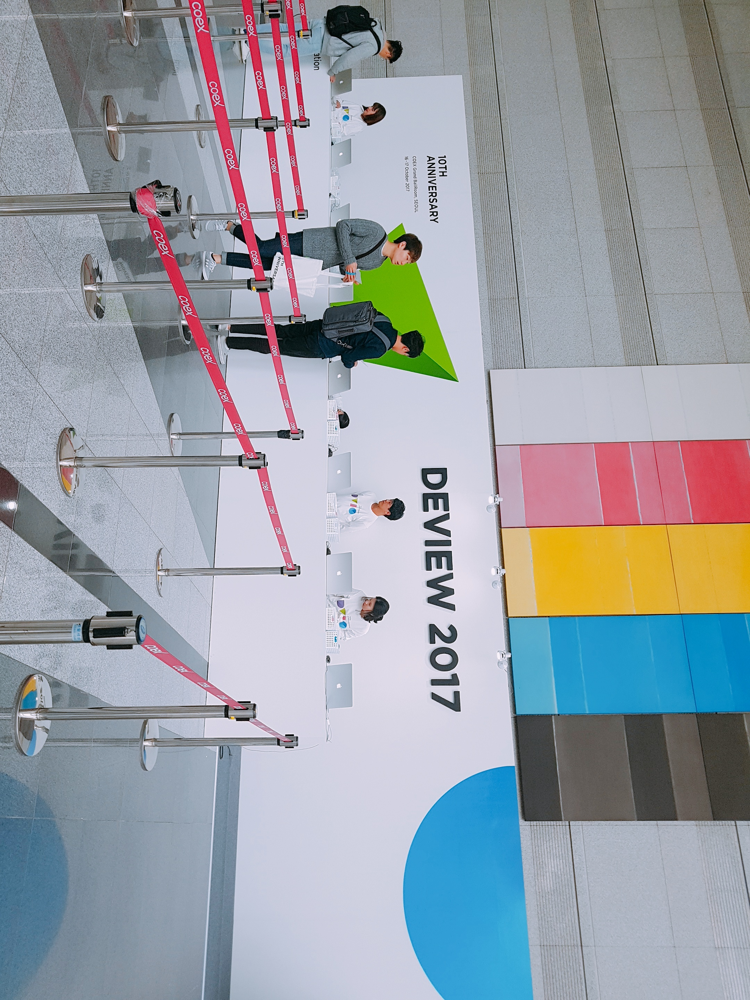
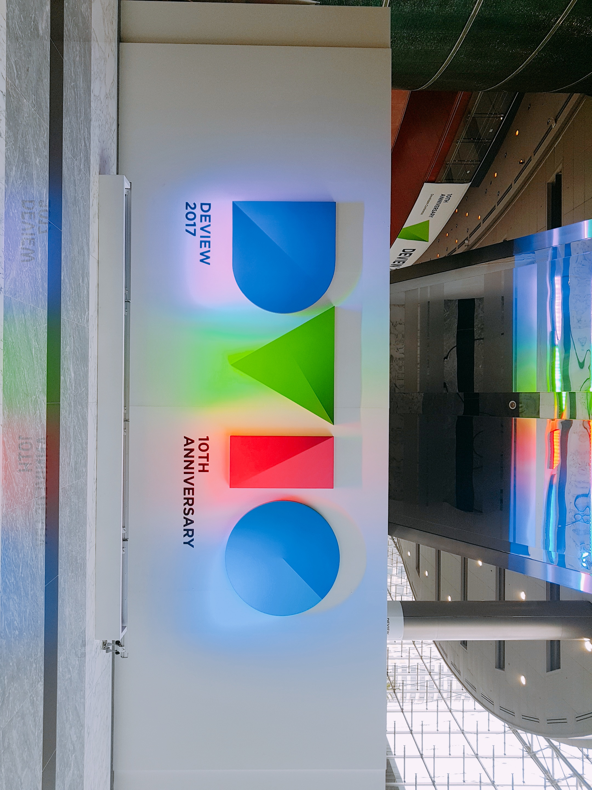
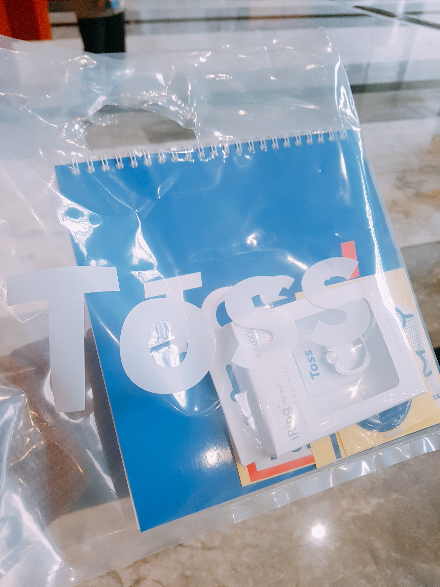
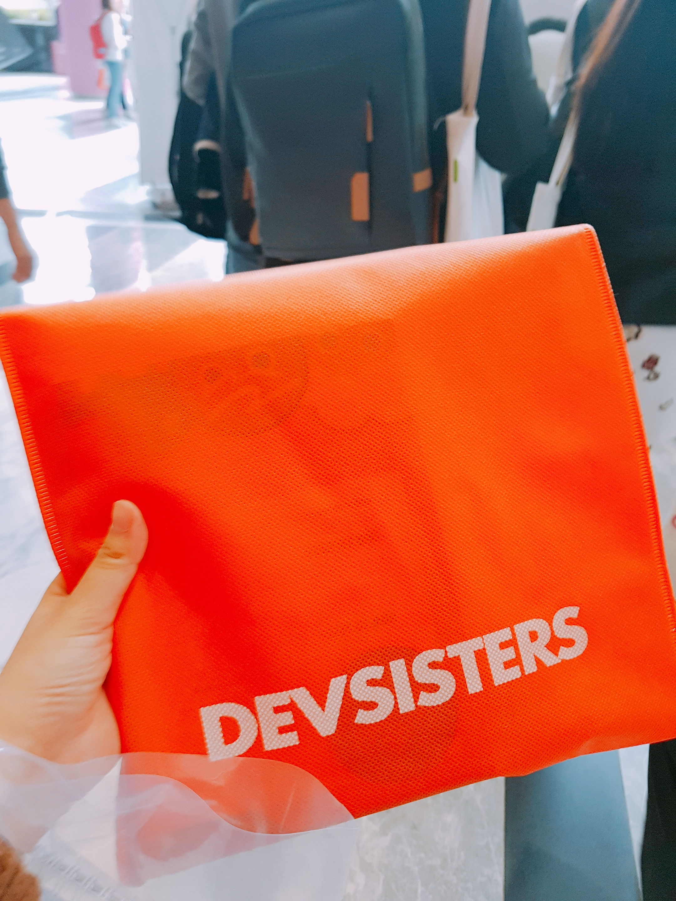
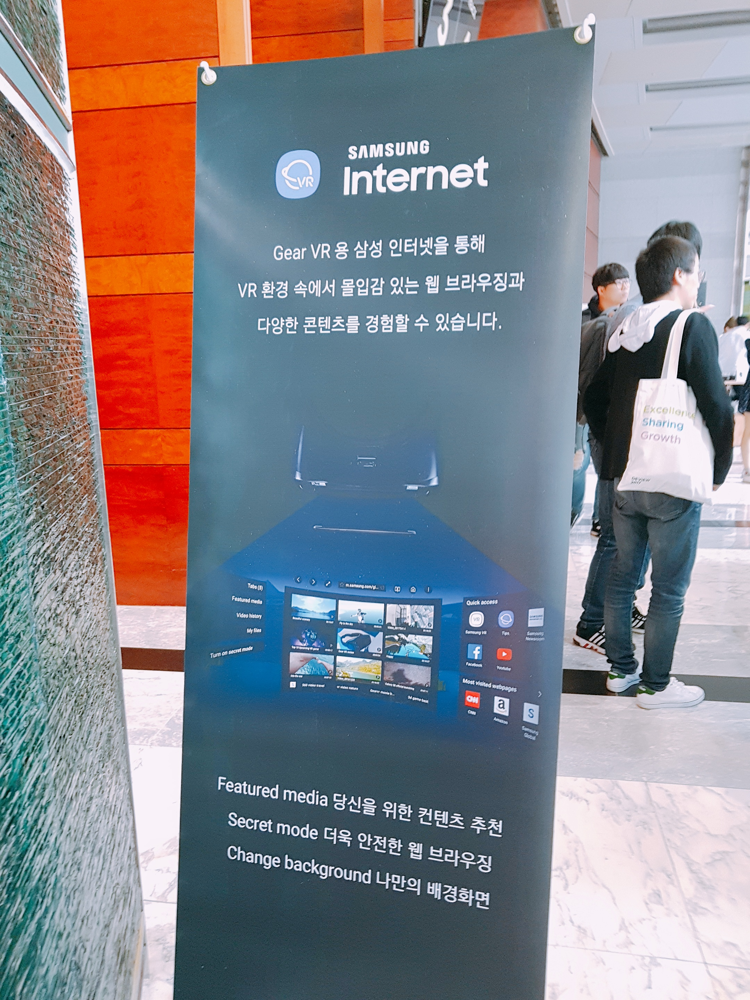
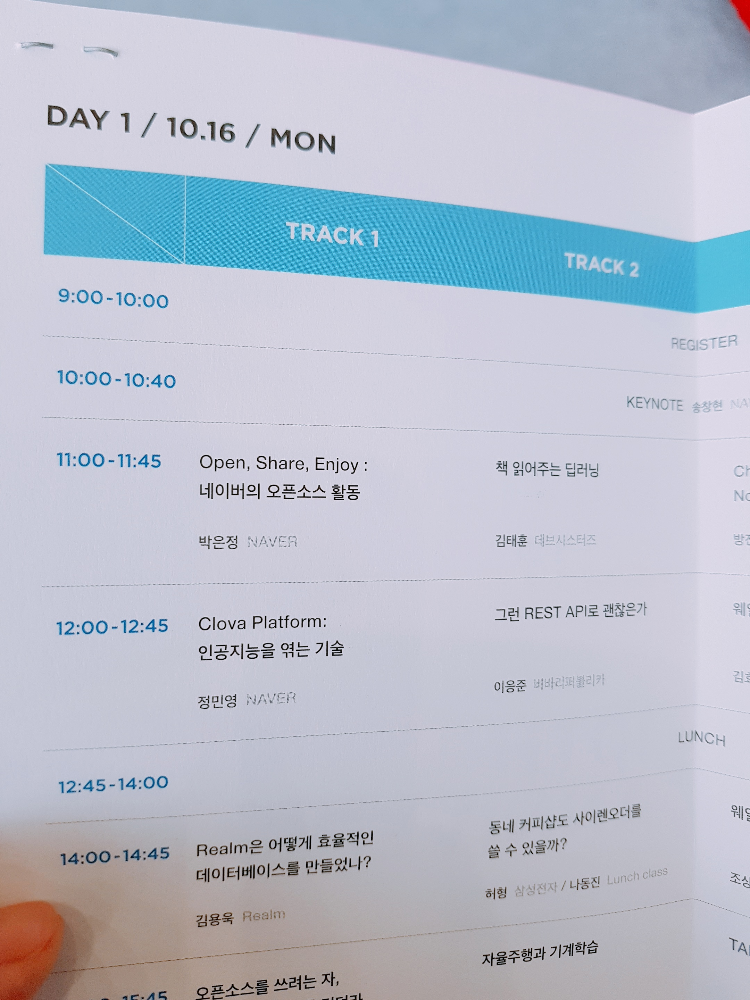

# Deview2017
###### *2017.10.16 ~ 2017.10.17 - 코엑스 그랜드 볼룸*

## 개요
국내 최대(?) 개발자 컨퍼런스 [Deview2017](https://deview.kr/2017) 예매날. 오후 2시 50분에 우리 사무실에서는 묘한 긴장이 흘렀다. 이거슨 마치 전국민 수강신청의 분위기! 작년에도 1분도 채 되지 않아 마감되었던 터라 더욱 긴장되는 순간이었다. 59분 부터 떨리는 마음으로 무한 클릭질 시작!
결과는.....
**day1, day2 티켓 모두 겟!!!!**
만세만세 만만세!!!! 이틀 모두 갈 수 있다니 만세!!!!!!!!!!
작년에는 day2만 갈 수 있었는데 올해는 운이 좋게도 이틀 다 갈 수 있게 되었다 :-) 뿌듯

## Hello, Deview2017!
올해도 코엑스 그랜드볼룸. 삼성역에서 내려서도 꽤 걸어가야하는 거리이다. 작년에는 길을 엄청나게 헤멨지만 올해에는 단번에 길을 찾았다 :-)

가까워질수록 나를 반기는 데뷰 현수막. 후후 신난다.

Deview가 벌써 **10주년**이라고 한다. 
웰컴키트를 받아들고 입장해보니 나를 반기는 Deview 부스 :-)

영롱하고 아름답군 :-D

키노트를 듣다가 도중에 나와 부스투어를 했다. 이번에는 굿즈가 굉장히 실하다 :-)
* 토스

* 데브시스터즈

올해에는 삼성전자도 부스를 열었다. "Samsung Internet"팀이 애자일 컨퍼런스에 이어 데뷰2017에도 모습을 나타냈다. 삼성전자도 점점 개발자 컨퍼런스에 모습을 비추는 것 같다 :-)

Samsung Internet 부스에 반가운 얼굴이 있었다. 같은 멤버십 출신의 임직원이었다 :-) 반갑게 인사하고 VR 체험 후 굿즈를 받았다!

스티커가 귀여웠다. Samsung Internet팀은 다양한 시도를 하는 것 같다. 

키노트를 듣지않고 부스투어를 하는 사람들이 꽤 많았다. 네개의 부스를 돌고나니 웨이팅하느라 다리가 아파와서 중간에 있던 소파자리에 앉아 짐정리를 했다. 벌써 에코백이 몇개야@_@;

소파에 기대어 찬찬히 스케줄표를 읽어보는데, "책 읽어주는 딥러닝"세션이 눈에 띄었다. 잊고 있었던 멤버십 때의 추억이 다시 떠올랐다. ~~동해물과 백두산이...~~

쉬다보니 점점 11시가 다가와 후다닥 Track3로 이동해서 자리를 잡았다!

자, 이제 본격적으로 **Deview 2017 시작!**

## Day 1
> Day 1 관련 내용 요약은 [여기](../20171016_Deview2017_day_1.md)

내가 들었던 세션들 목록은 다음과 같다.

| 시간 | 세션 | 발표자료 |
|--------|--------|--------|
|11:00 ~ 11:45|Chrominum Binding 기술을 활용하여 Node.js와 네이티브 모듈 우아하게 연동하기 |[#](https://www.slideshare.net/deview/131chromium-binging-nodejs)|
|12:00 ~ 12:45|그런 REST API로 괜찮은가|[#](http://slides.com/eungjun/rest#/)|
|14:00 ~ 14:45|웨일 브라우저 보안 이야기|
|15:00 ~ 15:45|오픈소스를 쓰려는 자, 리베이스의 무게를 견뎌라 -> 자율주행과 기계학습|[#](https://www.slideshare.net/deview/141-80845169) -> [#](https://www.slideshare.net/deview/124-80844653)|
|16:00 ~ 16:45|오픈소스 데이터베이스, 은행 서비스에 첫발을 내밀다.|[#](https://www.slideshare.net/deview/135-80845610)|

작년에 비해 올해에는 Day1, 2 모두 대부분 백엔드/AI관련 세션들로 채워졌다. 작년에는 그래도 모바일이나 네이티브 관련 세션들이 간간히 보였는데 올해에는 많이들 사라졌다. 역시 이제는 가상화와 AI의 시대인 듯 하다.

일단 첫 날이라 그런지 살짝 어수선 한 감이 있었다. 10주년이나 된 컨퍼런스임에도 불구하고 시간이 제대로 지켜지지 않았던 점과 올해에도 질의응답 시간이 존재하지 않았던 점이 아쉬움으로 남았다. 시간관리 부분은 Day2에서는 좀 나아지려나? 발표를 들어보니 Deview 운영측에서 발표자료를 꽤나 디테일하게 관리하는 것 같던데....

## Day 2
> Day 2 관련 내용 요약은 [여기](../20171017_Deview2017_day_2.md)

아직 시차적응이 되지 않았나보다. 새벽 2시가 되어서야 겨우 잠이 들었는데 이상하게도 6시에 눈이 떠졌다. 전혀 개운하지 않은데도 떠진 눈이라 너무 괴로웠다. 더 자지않으면 하루를 완전 망칠 것 같아 억지로 잠을 청해보았지만 잘 되지 않았다. 겨우 잠들었다 눈을 떴는데 9시. 으아 안돼! 10시부터 데뷰시작인데ㅠㅠ 일찍가서 어제 못한 부스투어를 마저하려고 했던 나의 계획이 무너졌다. 일단 빠르게 준비하고 집을나와 코엑스 그랜드 볼룸으로 향했다. 첫번째 세션을 패스하고 두번째 세션부터 들었다. 

내가 들었던 세션들 목록은 다음과 같다.

| 시간 | 세션 | 발표자료 |
|--------|--------|--------|
|11:00 ~ 11:45|실시간 조작을 통한 Neural Machine Translation 동작 분석 방법|[#](https://www.slideshare.net/deview/222neural-machine-translation-nmt-80852324)|
|12:00 ~ 12:45|RYE, 샤딩을 지원하는 오픈소스 관계형 DBMS|[#](https://www.slideshare.net/deview/223rye-dbms)|
|14:00 ~ 14:45|~~유연하고 확장 가능한 빅데이터 환경 구성~~||
|15:00 ~ 15:45|??|[#](?)|
|16:00 ~ 16:45|인공지능 추천 시스템 AiRS 개발기 : 모델링과 시스템|[#](https://www.slideshare.net/deview/airs-80886207)|

전반적으로 Day 2는 Back-end와 BigData, Machine Learning 세션들이 대부분을 차지했다. Day 1도 작년에 비해서는 훨씬 위의 세션들의 비중이 높았었는데, 이 부분도 대세를 잘 보여주는 부분이라는 생각이 들었다. 

현재 진행중인 프로젝트에 도움이 될 만한 정보들은 Day 2에서 더 많이 얻을 수 있었던 것 같다. 나를 포함하여 대부분이 이 쪽 분야에 대한 지식이 깊지 않은 상태에서 이 내용을 어떤식으로 전달을 해야 효과적으로 전달할 수 있을지 고민이다. 사실 내가 이해한 것이 맞을지에 대한 의문이 더 크다.

## 마무리
적고보니 아쉬운 점이 훨씬 길어서 당황스럽;지만 **사실 굉장히 만족스러운 컨퍼런스**였다. 왜 나는 언제나 긍정적인 면을 적는게 더 힘이 들까.

### 좋았던 점
* 다양한 분야에 대한 국내 트렌드를 빠르게 파악할 수 있는 자리였다!
* 각 회사의 채용에 대한 이야기도 듣고 볼 수 있어 좋았다.
* 국내 오픈소스에 대한 소개가 되어 좋았다. 영어의 벽을 느끼던 개발자들도 문을 두드려볼 수 있도록 이끌었다. 특히 오픈소스 관련 책자를 나눠주면 네이버 오픈소스 부스 정말 좋았다. :-)

### 아쉬웠던 점
* Q&A 시간이 없는 부분이 아쉬웠다. 다른 컨퍼런스에 비해서 일찍 끝나는 편임에도 불구하고 Q&A시간이 없다. 질의응답 시간이야말로 발표자와 청중 모두 더욱 심화된 정보를 주고 받을 수 있는 시간이라고 생각한다. 다음 Deview때에는 컨퍼런스 종료 시각을 좀 늦추더라도 질의응답 시간이 포함되었으면 좋겠다.

* 네이티브나 모바일 쪽에 대한 세션이 부족한 것이 아쉬웠다.

* 개인적으로, 기술 설명 이후에 프로젝트를 간략하게 설명하는 정도의 세션들이 더 듣기 편했던 것 같다. 비율로 따지자면 기술 설명과 프로젝트 소개의 비율이 8:2나 9:1 정도가 딱 좋았다. 초반부터 프로젝트만 이야기한다든지 중반부부터 아예 본격적으로 프로젝트를 소개한다든지 하는 흐름으로 가는 세션들은 듣기 조금 힘들었다. Deview는 국내 최대규모를 자랑하는 개발자 컨퍼런스이지 네이버나 각 회사의 제품을 홍보자리가 아니다.

### Tips
* 작년과 마찬가지로 도시락이 제공되지 않는다. 예전에는 점심식사 쿠폰을 제공해줬다는 이야기가 있던데 카더라라 확실하지는 않다. 무료 컨퍼런스인 만큼 이런 부분은 어쩔 수 없는 듯 하다.

* 점심식사는 푸드코트에서 하는 것이 시간도 절약되고 편하다. 일반 푸드코트와는 다르게 CJ음식점이 모여있는 형식이라 맛도 있고 좋다. 다만 조명이 센편이라 너무 더웠다. 식사 중에 땀을 엄청 흘렸다..

* 자리에는 책상없이 의자만 존재하고, 아답터는 트랙별 문 앞에만 존재하니 노트북 및 핸드폰 배터리 관리를 잘 해야한다 :-)

* 발표장 출입구쪽에 발표를 촬영하고 있는 카메라가 있으므로 건드리지 않도록 주의하자.

* 무료 커피는 얼음이 빠르게 소진되니 아이스 아메리카노를 먹고 싶다면 오전에 줄을 서도록 하자.