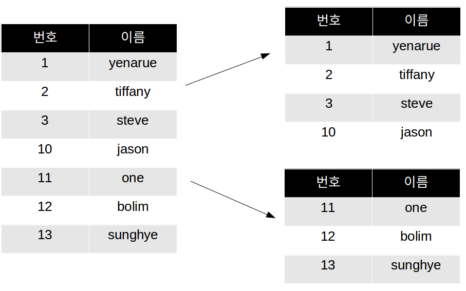
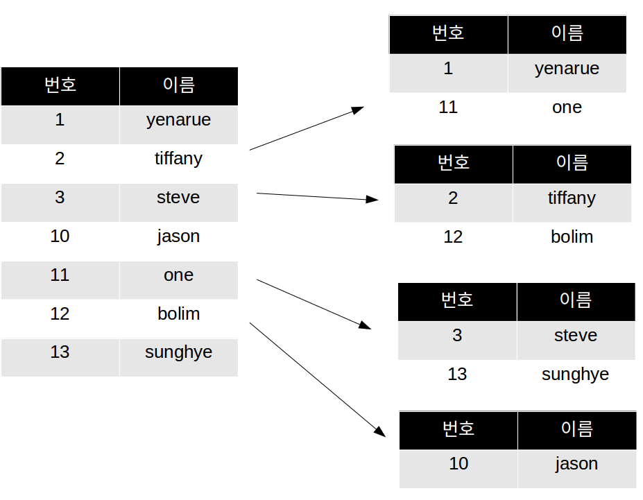
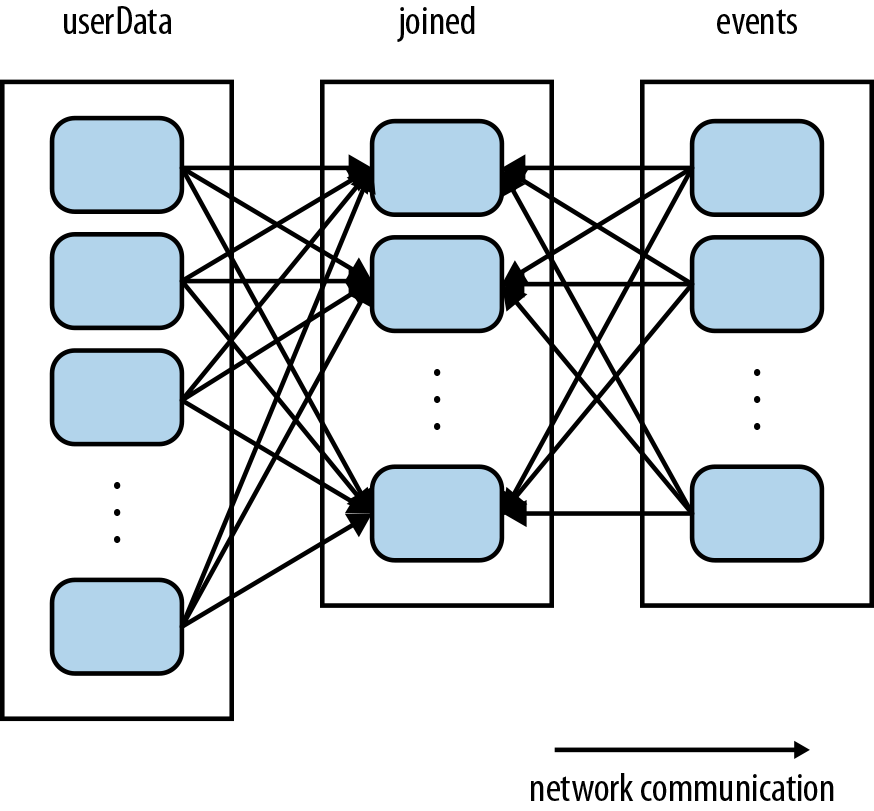
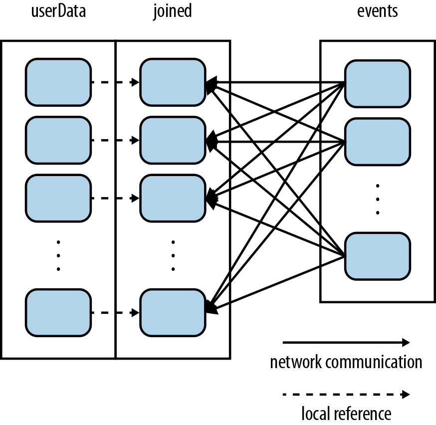

# Partioning
## Partitioning 이란?
RDD의 데이터는 클러스터를 구성하는 여러 서버(노드)에 나누어 저장된다. 이때, 나누어진 데이터를 **파티션**이라는 단위로 관리한다.
HDFS를 사용하는 경우에는 기본적으로 HDFS 블록과 파티션이 1:1으로 구성되지만 스파크 API를 사용하면 파티션의 크기와 수를 쉽게 조정할 수있다.
이렇게 파티션의 **크기**와 **수**를 조정하고 파티션을 **배치하는 방법**을 설정하여 RDD의 구조를 제어하는 것을 **파티셔닝** 이라고 한다.
파티션의 크기나 수를 변경하느냐에 따라 애플리케이션의 성능이 크게 변할 수 있으므로 스파크의 동작을 잘 이해하고 적절하게 설정해야 한다.
* 스파크에서 올바른 파티셔닝 방법을 선택하는 것 = 일반적인 프로그래밍에서 올바른 자료구조를 선택하는 것

### 주의사항
파티셔닝이 모든 상황에 대해서 성능을 개선시켜주는 것은 아니다! RDD가 단 한번만 스캐닝된다면? 굳이 파티셔닝 할 필요가 없음. 오히려 비효율.
파티셔닝은 조인 같은 **키 중심**의 Pair RDD연산에서 **데이터 세트가 여러번 재활용 될 때에만 의미가 있다.**

## Partitioning의 종류
스파크는 모든 Pair RDD에 대하여 파티셔닝이 가능하다! 
키별로 노드를 지정해줄 수 는 없지만 **동일한 키끼리 특정 노드에 모여있게 하는 것은 보장**해준다.


### 범위별 파티셔닝 (Range Partitioning)
특정 범위내에 있는 키들을 동일한 노드로 모은다. 파티션의 크기를 지정해주면 그 크기내에서 최대한 흩뿌리기(?) 위해서 노력한다!!
```scala
val userData = sc.parallelize(Array((1, "yeanrue"), (2, "tiffany"), (3, "steve"), (10, "jason"), (11, "one"), (12, "bolim"), (13, "sunghye")))
val rangePartitioner = new RangePartitioner(5, userData)
val rangedUserData = userData.partitionBy(rangePartitioner).persist()
// rangedUserData.glom().collect()를 출력한 결과 :
// [(1,yeanrue)(2,tiffany)]
// [(3,steve)]
// [(10,json)(11,one)]
// [(12,bolim)]
// [(13,sunghye)]
```


### 해시 파티셔닝 (Hash Partitioning)
동일한 해시값을 가지는 키들을 동일한 노드로 모은다. 파티션의 크기를 지정해주면 그 크기로 나눈 해시값에 맞는 키로 배치한다.
```scala
val userData = sc.parallelize(Array((1, "yeanrue"), (2, "tiffany"), (3, "steve"), (10, "jason"), (11, "one"), (12, "bolim"), (13, "sunghye")))
val hashedUserData = userData.partitionBy(new HashPartitioner(5)).persist()
// hashedUserData.glom().collect()를 출력한 결과 :
// [(10,json)]
// [(1,yeanrue)(11,one)]
// [(2,tiffany)(12,bolim)]
// [(3,steve)(13,sunghye)]
// []
```



## 사용자 지정 파티셔닝 (Custom Partitioning)
`Partitioner` 클래스를 상속해서 아래의 메소드를 구현하면 사용자 지정 파티셔너를 만들 수 있다.
* int numPartitions() : 생성할 파티션의 개수를 리턴한다.
* int getPartition(key) : 주어진 키에 대한 파티션 ID를 리턴한다. (0 ~ numPartitions-1)
* boolean equals(other) : 두가지 RDD가 같은 방식으로 파티셔닝되는지 검사하는데 쓰인다.

```scala
class CustomPartitioner(numParts: Int) extends Partitioner {
		// 생성할 파티션의 개수를 리턴.
        override def numPartitions: Int = numParts

		// 주어진 key에 대한 파티션 ID 리턴
		// [주의] 음수를 리턴하지 않도록 조심해야함!
        override def getPartition(key: Any): Int = {
          val code = key.hashCode() % numPartitions
          if (code < 0) {
            code + numPartitions
          } else {
            code
          }
        }
        
		// 이걸로 파티셔너가 동일한지 검사하므로 제대로 구현해야 함!
        override def equals(other: scala.Any): Boolean = other match {
          case custom: CustomPartitioner => custom.numPartitions == numPartitions
          case _ => false
        }
      }
```

이 부분은 깊게 들어가면 끝이 없으니 관심이 있다면 스파크 공식 문서를 참조하도록 하자 :-D

## Partitioning을 실제로 적용해보자!
사용자 정보를 담고있는 RDD와 그 사용자들에 대한 이벤트 로깅 정보를 담고있는 RDD를 조인하는 경우를 살펴보자.
```scala
val userDataRDD = sc.parallelize(Array((1, "yeanrue"), (2, "tiffany"), (3, "steve"),
                                       (10, "jason"), (11, "one"), (12, "bolim"), (13, "sunghye")))
                    .persist()
val eventsRDD = sc.parallelize(Array((1, "enter"), (2, "enter"), (1, "leave"), (3, "enter")))
val joinedRDD = userDataRDD.join(eventsRDD)
// (1,(yeanrue,enter))
// (1,(yeanrue,leave))
// (2,(tiffany,enter))
// (3,(steve,enter))
```

이 경우에는 userDataRDD와 eventsRDD의 데이터셋을 모두 해싱해서 동일 키를 가지는 데이터를 또 다른 머신에 모이도록 한 다음, 해당 머신에서 동일한 키의 데이터끼리 조인을 수행한다. 일반적으로 userData가 events에 비해서 큰 변동이 있지는 않을텐데, userData에 변동이 없어도 이 경우에는 **조인을 할때마다 userData도 매번 해싱하고 셔플링이 된다.** 이는 심각한 **리소스 낭비**이다!
```scala
// userDataRDD에 변경사항이 없어도, 아래와 같이 조인시 재셔플링 된다ㅠㅠ
val eventsRDD = sc.parallelize(Array((10, "enter"), (11, "enter"), (11, "leave"), (12, "enter")))
val joinedRDD = userDataRDD.join(eventsRDD)
```
이를 해결하기 위해서는 userDataRDD에 partitionBy()를 사용하여 프로그램 시작 시에 **단 한번만 파티셔닝**을 하도록 지정해주면 된다.

### partitionBy()
```scala
val userDataRDD = sc.parallelize(Array((1, "yeanrue"), (2, "tiffany"), (3, "steve"), 
                                       (10, "jason"), (11, "one"), (12, "bolim"), (13, "sunghye")))
                    .partitionBy(new HashPartitioner(5))	// 파티션을 5개 만든다.
                    .persist()
val eventsRDD = sc.parallelize(Array((1, "enter"), (2, "enter"), (1, "leave"), (3, "enter")))
val joinedRDD = userDataRDD.join(eventsRDD)
// (1,(yeanrue,enter))
// (1,(yeanrue,leave))
// (2,(tiffany,enter))
// (3,(steve,enter))
```
userData가 처음 만들어질 때, 파티션을 미리 설정해두면 셔플링이 미리 이루어진다. 그렇기 때문에 조인시 아래와 같이 events만 셔플링이 일어나서  userData의 파티션이 있는 노드로 전송되어 조인이 된다! 네트워크 비용도 적게들고 속도도 빨라진다.



### 주의사항
`partitionBy()`를 사용하여 네트워크 통신 횟수와 셔플링 횟수를 줄이는 효과를 얻을 수 있다는 것을 알았다!
하지만 이러한 이점을 제대로 누리기 위해서는 `partitionBy()`를 설정한 다음에 **`persist()`를 호출**하여 영속화(캐싱)을 해줘야한다!
그렇지 않으면 RDD가 Lazy하게 실행될때마다 partitionBy에 의한 연산도 매번 실행될 것이기 때문에 아무런 이득이 없다..; 그냥 조인하는게 더 나을지경이 될 것이다.
**셔플링이 단 한번만 일어나게 하는 것**이 목적이라는 것을 기억하고, 꼭 `persist()`를 호출하여 고정시키도록 하자!

## 파티셔닝을 사용하면 도움이 되는 연산들
사실 파티셔닝이 모든 연산에 도움이 되는 건 아니다. 키별로 데이터를 셔플링하는 과정을 거치는 연산들에만 도움이 될 수 있다. :-)
그럼 그 연산들에는 어떤 것들이 있는지 알아보자!
`cogroup()`, `groupWith()`, `join()`, `leftOuterJoin()`, `rightOuterJoin()`, `groupByKey()`, `reduceByKey()`, `combineByKey()`, `lookup()` 등...

## 파티셔닝에 영향을 주는 연산들

### 결과RDD에 파티셔너가 지정되지 않는 연산들
지정된 파티셔닝이 보장되지 않는 연산들은 결과RDD에 파티셔너가 지정되지 않는다. 예를 들어 `map()`의 경우를 보면, 리턴타입이 가변적이므로 키가 변경될 가능성을 가지고 있다. 그렇기 때문에 결과RDD에 특정한 파티셔너를 지정할 수 없다.
연산후에 파티셔너를 유지하고 싶다면, 키를 유지하는 것이 보장되는 연산을 쓰는 것이 좋다. 예를 들면 `map()`대신 `mapValues()`를 쓰면 파티셔닝이 유지된다.

### 결과RDD에 파티셔너가 지정되는 연산들
> `cogroup()`, `groupWith()`, `join()`, `leftOuterJoin()`, `rightOuterJoin()`, `groupByKey()`, `reduceByKey()`, `combineByKey()`, `partitionBy()`, `sort()`, `mapValues()`, `flatMapValues()`, `filter()` 외에는 모두 결과RDD에 파티셔너가 지정되지 않는 연산들이다.

join의 경우에는, 결과RDD가 파티셔닝을 하는 연산에 의해서 만들어지며, 하나의 머신에 모인다. 그러므로 그 결과RDD에 reduceByKey()연산을 수행하면 굉장히 빠르게 수행될 수 있다.

## 파티셔닝의 효과를 톡톡히 보는 예제 : 페이지 랭크 (Page Rank)
### '페이지 랭크'란?
구글의 공동창업자인 래리페이지(Larry Page)의 이름을 딴 알고리즘으로, **얼마나 많은 문서들이 해당 문서를 링크하고 있는지를 기반으로 각 문서에 중요도 랭킹을 매기는 알고리즘**이다. SNS에서 영향력있는 사용자를 찾아낼 때에도 이 알고리즘이 사용된다.


## 참고자료들
- 코드단에서 현재 지정된 partition 정보 보는법 : http://parrotprediction.com/partitioning-in-apache-spark/