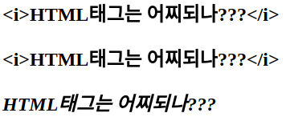

# Vue.js

## 개요
**Vue.js**는 SPA(Single Page Application, 단일 페이지 애플리케이션) 아키텍처 기반으로 만들어진 프론트엔드 자바스크립트 프레임워크이다.
MVVM 패턴을 따르고 있다. 

가상 DOM을 지원하기 때문에 UI 렌더링 속도가 굉장히 빠르다. 그러면서도 JS 파일 크기는 굉장히 작다.
[[Vue 공식 튜토리얼] 다른 프레임워크와의 차이점](https://kr.vuejs.org/v2/guide/comparison.html)


## Vue 프로젝트 만들어보기
### Vue CLI 설치 및 실행
Vue CLI는 Vue.js에서 공식적으로 지원하는 스캐폴딩 도구이다.
```bash
$ sudo npm install -g vue-cli
$ vue list

  Available official templates:

  ★  browserify - A full-featured Browserify + vueify setup with hot-reload, linting & unit testing.
  ★  browserify-simple - A simple Browserify + vueify setup for quick prototyping.
  ★  pwa - PWA template for vue-cli based on the webpack template
  ★  simple - The simplest possible Vue setup in a single HTML file
  ★  webpack - A full-featured Webpack + vue-loader setup with hot reload, linting, testing & css extraction.
  ★  webpack-simple - A simple Webpack + vue-loader setup for quick prototyping.
$ vue init simple HelloVuejs

? name hellovuejs
? author yenarue <yenarue@gmail.com>

   vue-cli · Generated "HelloVuejs".
```

### Vue 프로젝트 구성
* 모델 (model) : 데이터를 가지고있는 모델 객체
* Vue 객체 : ViewModel (el : HTML element(View), data : Model 객체). 데이터가 변경되면 뷰에 바로 적용시킨다.
* HTML : View. {{}} 으로 HTML DOM에 데이터를 렌더링한다.

```javascript
  <div id="simple">
    <h1>{{title}}</h1>
    <h2>{{message}}</h2>
  </div>
  
  <script type="text/javascript">
  	// Model
    var model = {
      title: 'Hello, Vue.js World!',
      message : '예나르의 첫 번째 Vue.js 애플리케이션'
    };

    // ViewModel
    var simple = new Vue({
      el: '#simple',  // HTML element (View)
      data: model     // Model
    })
  </script>
```


위의 구조는 **반응형** 작업을 가능하게 한다 : Model을 변경하면 ViewModel 객체를 통해 HTML DOM이 즉시 변경된다.

## Vue.js 디렉티브
### v-text와 v-html
v-text는 innerText 속성에 연결되고 v-html은 innerHTML 속성에 연결된다. v-html 디렉티브는 `<script>` 태그를 그대로 바인딩 하기때문에 XSS 공격 등에 취약하다. 꼭 필요한 경우가 아니라면 v-text 디렉티브를 쓰자.
```xml
<h2>{{message}}</h2>
<h2 v-text="message"></h2>
<h2 v-html="message"></h2>
```
개발자모드에서 콘솔에 아래와 같이 message 데이터에 값을 넣어보면
```console
model.message="<i>HTML태그는 어찌되나???</i>";
```
다음과 같이 차이를 알 수 있다.


### v-bind
element의 콘텐츠 영역이 아닌 속성들을 바인딩하기 위해 사용한다.
`v-bind`는 생략가능하다.
```xml
<input id="a" type="text" v-bind:value="message">

<!-- 위아래 같음 -->
<input id="a" type="text" :value="message">

```

### v-model
양방향 바인딩 디렉티브. (`v-text`, `v-html`, `v-bind`는 단방향 바인딩 이다)
```xml
<input id="a" type="text" v-model:value="name" placeholder="이름을 입력하세요">
입력된 이름 : <h2 v-html="name"></h2>
```
이름이 변경될 때 마다 아래 텍스트도 함께 변경된다.

### v-show, v-if, v-else, v-else-if
**v-if**, **v-else-if**, **v-else** : 조건에 맞으면 렌더링
**v-show** : 렌더링 해놓고 조건에 맞으면 visible
`v-if` 류 사용 시, 변경된 부분만 재렌더링 한다. 그게 맘에 들지 않는다면 `key` 속성을 사용해서 아예 처음부터 렌더링 되도록 하자. [#참고](https://kr.vuejs.org/v2/guide/conditional.html#key를-이용한-재사용-가능한-엘리먼트-제어)
```xml
<!-- Vue.js Guide에서 발췌 -->
<template v-if="loginType === 'username'">
  <label>사용자 이름</label>
  <input placeholder="사용자 이름을 입력하세요" key="username-input">
</template>
<template v-else>
  <label>이메일</label>
  <input placeholder="이메일 주소를 입력하세요" key="email-input">
</template>
```

### v-for
```xml
<tr v-for="contact in contacts"></tr>
<option v-for="(val, key) in regions" v-bind:value="key">{{val}}</option>
```

### 그 외
#### v-pre
컴파일 하지 않는다.
```xml
<h1 v-pre>{{message}}</h1>
```
{{message}} 로 출력된다.

#### v-once
한 번만 렌더링 된다.
값이 한번 주어지면 변경되지 않는 UI를 만들 때 사용한다.
v-if와 함께 쓰면 용이할 듯 하다.
```xml
  <div id="simple">
    <div v-once v-if="test!=0">{{test}}</div>
  </div>

  <script type="text/javascript">
    // Model
    var model = {
        test : 0
    };

    // ViewModel
    var simple = new Vue({
      el: '#simple',  // HTML element (View)
      data: model     // Model
    });
  </script>
```

#### v-cloak
화면 초기에 컴파일 되지 않은 템플릿은 나타나지 않도록 한다.
데이터 양이 증가하면 컴파일 시간이 길어져서 {{}}와 같은 Vue의 표현식이 UI에 그대로 노출되는 경우가 생긴다. 복잡한 UI일 경우 더욱 빈번하게 발생한다. 그럴때 `v-cloak`을 사용하면 된다.
```xml
<head>
  <style>
    [v-cloak] { display:none; }
  </style>
</head>
<body>
<div id="example" v-cloak>
```

#### 주의사항
* 배열 데이터 변경시 인덱스로 바로 접근하여 객체를 통채로 변경하면 바인딩 적용이 되지 않는다. 도중에 바인딩이 변경될 수 없기 때문이다. 인스턴스 변경이 일어나지 않는 선에서 데이터를 변경해야 바인딩이 유지된다. 꼭 통채로 변경해야 한다면 Vue.set()을 이용하도록 하자.

## Vue 인스턴스
### 옵션
#### el
Vue 인스턴스에 연결할 HTML DOM 요소를 지정한다. 단일 요소만 지정 가능하다. `new Vue().$mount("#app")`과 같이 동적으로 지정할 수 있으나 el으로 미리 연결하는 것을 권장한다.

#### data
내부적으로 Vue인스턴스와 Data 객체 사이에 프록시를 두어서 처리한다. 물론 `vm.$data`로 직접 접근할 수도 있다.
```xml
<div id="test">
	{{name}}
</div>
<script type="text/javascript">
var model = {
	name : "Yenarue"
}
var vm = new Vue({
	el : "#test",
    data : model
})
</script>
```
이 경우, `vm.name`, `model.name`, `vm.$data.name` 모두 접근 가능하다.

#### computed vs method
* computed : "계산된" 이라는 이름에서도 알 수 있 듯이, 매개변수에 따라 결과 값을 캐싱해놓는다. 호출 시 마다 매번 재연산하지 않는다.
* method : 그냥 메서드이다. 호출 시 마다 재연산 된다.

#### watch
특정 데이터를 바라보고 있다가 변경되었을 때 호출되는 메서드 이다. 오랜 시간 뒤에 응답이 오는 비동기 처리 시에 자주 쓰인다.
[Network Example](https://github.com/stepanowon/vuejs_book/blob/master/ch03/03-08~09.html)

#### 주의할 점
* method 작성 시 Arrow Function은 사용하면 안된다. 람다/추상함수 내에서는 this가 Vue인스턴스를 가리키지 않고 전역 객체를 가리키게 되기 때문이다.

## Vue 인스턴스의 라이프 사이클


## 트리비아
* IntelliJ IDEA의 Community 버전에서는 nodejs 플러그인을 찾을 수 없다. 커뮤니티 버전은 자바스크립트를 지원하지 않기때문.. (너무해) JetBrain쪽 IDE를 쓰고싶다면 걍 첨부터 웹스톰을 쓰도록하자. (30분 강제 뽀모도르 개이득)
* VS Code도 사용하기 좋은 듯 하다. 더 사용해보고 괜찮으면 넘어가야겠다.
* [Airbnb ESLint를 끼워보자](https://www.themarketingtechnologist.co/eslint-with-airbnb-javascript-style-guide-in-webstorm/)